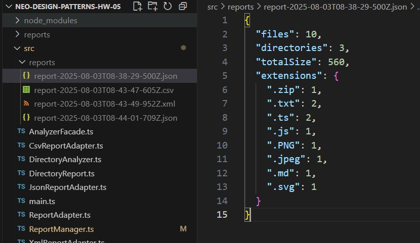
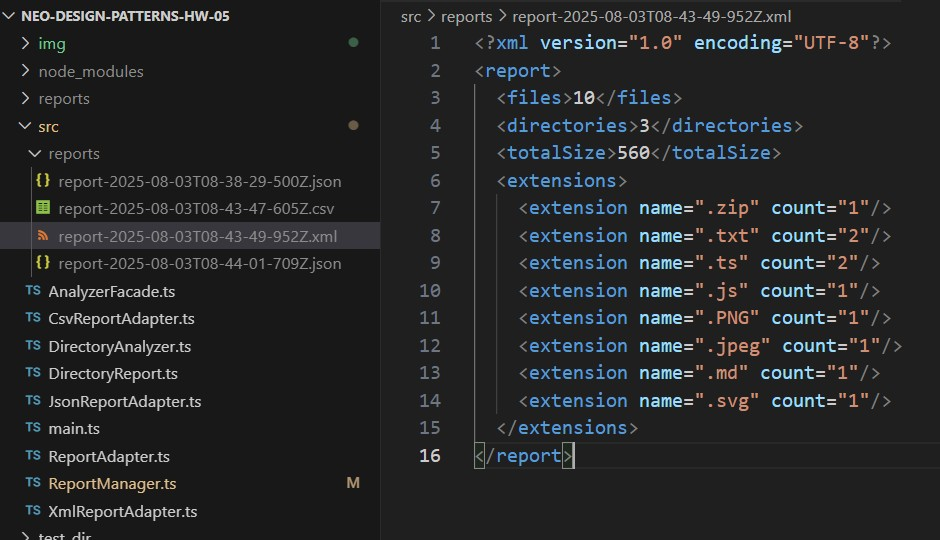
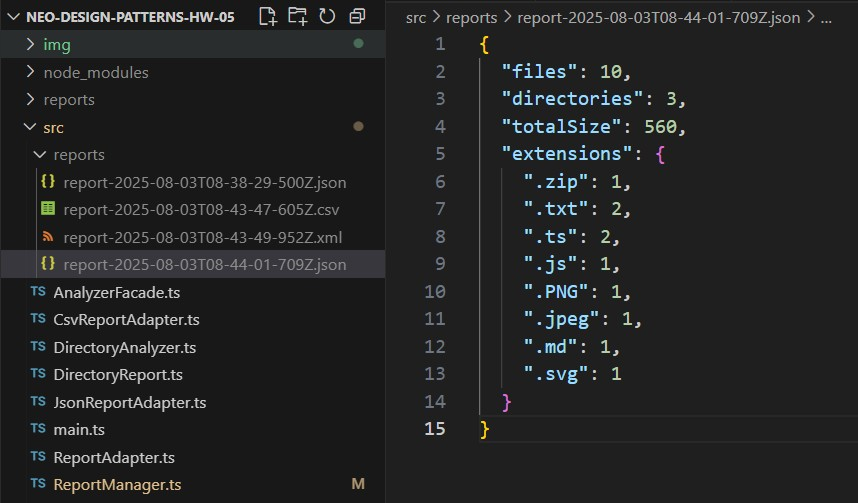

# Домашнє завдання до Теми Структурні патерни: Адаптер та Фасад

### Опис завдання

Мета домашнього завдання — опанувати застосування структурних патернів у реальному контексті, а саме:

- Фасад (Facade) — для спрощення складного процесу аналізу і побудови звіту;
- Адаптер (Adapter) — для уніфікації форматів виводу звіту.

Наше домашнє завдання моделює ситуацію зі створення справжньої інструментальної утиліти, яка зустрічається у проектах з CLI-архітектурою.

Реалізуйте консольну утиліту для аналізу файлової системи, яка:

- виконує повний аналіз обраної директорії;
- генерує звіт про її вміст;
- зберігає цей звіт у форматі `JSON`, `CSV` або `XML` залежно від обраного режиму;
- демонструє поєднання двох структурних патернів: Адаптер і Фасад;
- застосовує ієрархію фасадів: високорівневий фасад керує низькорівневим.

Архітектурні особливості застосунку наступні.

- Застосунок має два ієрархічні фасади:
  - `ReportManager` — високорівневий фасад, керує всім життєвим циклом;
  - `AnalyzerFacade` — низькорівневий фасад, координує аналіз і форматування;
- Патерн Адаптер дозволяє підключати нові формати без зміни вже написаної логіки застосунку;
- Розділення обов’язків — кожен компонент відповідає лише за свою зону.

### Патерни проектування

#### 1. Патерн "Фасад"

У проекті реалізовано два рівні фасадів:

1. **AnalyzerFacade** (низькорівневий фасад):

   - Приховує складність роботи з DirectoryAnalyzer
   - Координує взаємодію між аналізатором та адаптером
   - Надає простий метод generateReport()

2. **ReportManager** (високорівневий фасад):
   - Приховує роботу з AnalyzerFacade
   - Керує вибором адаптерів
   - Займається файловою системою
   - Обробляє помилки
   - Форматує імена файлів

#### 2. Патерн "Адаптер"

Реалізовано через інтерфейс ReportAdapter з трьома конкретними реалізаціями:

- JsonReportAdapter
- XmlReportAdapter
- CsvReportAdapter

### Структура файлів

├── DirectoryReport.ts # Інтерфейс звіту
├── DirectoryAnalyzer.ts # Аналіз директорій
├── ReportAdapter.ts # Інтерфейс адаптера
├── JsonReportAdapter.ts # Адаптер для JSON
├── XmlReportAdapter.ts # Адаптер для XML
├── CsvReportAdapter.ts # Адаптер для CSV
├── AnalyzerFacade.ts # Низькорівневий фасад
├── ReportManager.ts # Високорівневий фасад
└── main.ts # Точка входу

## Встановлення та запуск

1. Встановіть залежності:

npm install

2. Запуск:

npx ts-node src/main.ts ./test_dir json
npx ts-node src/main.ts ./test_dir csv
npx ts-node src/main.ts ./test_dir xml

## Результати

Звіти зберігаються в директорії `reports` з іменами виду:

- `report-2025-08-03T08-38-29-500Z.json`
  
- `report-2025-08-03T08-43-49-952Z.xml`
  
- `report-2025-08-03T08-43-47-605Z.csv`
  
- `report-2025-08-03T08-44-01-709Z.json` з новою часовою міткою
  
